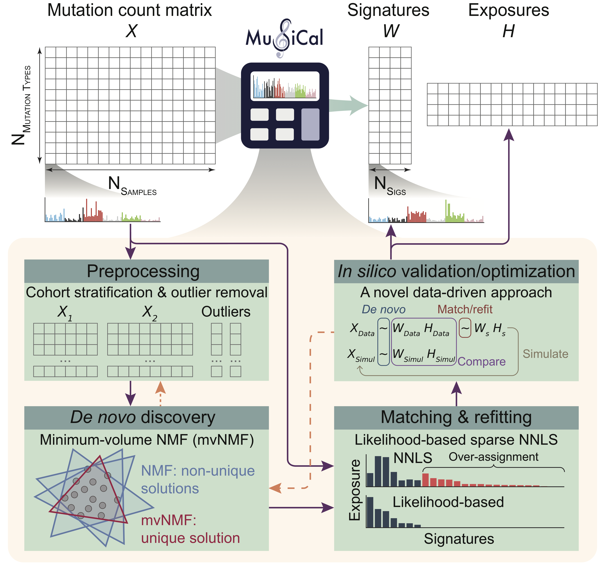

**MuSiCal** (<ins>Mu</ins>tational <ins>Si</ins>gnature <ins>Cal</ins>culator) is a comprehensive toolkit for mutational signature analysis. It leverages novel algorithmic developments to enable accurate signature assignment as well as robust and sensitive signature discovery.

## Installation

MuSiCal requires Python 3.7 or above. We recommend conda for managing packages and environments. If you do not have conda on your system yet, you can install conda through [Anaconda](https://docs.anaconda.com/anaconda/install/index.html "Installation guide for Anaconda") or [Miniconda](https://docs.conda.io/en/latest/miniconda.html "Installation guide for Miniconda").

You will also need Jupyter Notebook to try out the [example scripts](./examples). If you have installed Anaconda, Jupyter Notebook will be installed already. Otherwise, follow this [guide](https://docs.jupyter.org/en/latest/install/notebook-classic.html "Installation guide for Jupyter Notebook") to install Jupyter Notebook separately. Note that it is better to install Jupyter Notebook in the `base` environment.

### Third-party distributions

MuSiCal will be made available via conda soon. Once that is done, you can follow these steps to install MuSiCal.

Create a conda environment:
```
conda create -n python37_musical python=3.7
```

Activate the environment with `conda activate python37_musical` or `source activate python37_musical`, depending on the version of conda you have on your system.

Install MuSiCal:
```
conda install -c bioconda musical
```

For now, please follow the instructions below to install from source.

### Installing from source

First, download the latest repository (e.g., via `git clone`, by downloading the zip file directly, etc.).

Then, create a conda environment:
```
conda create -n python37_musical python=3.7
```

Activate the environment with `conda activate python37_musical` or `source activate python37_musical`, depending on the version of conda you have on your system.

Install some dependencies:
```
conda install numpy scipy scikit-learn matplotlib pandas seaborn
```

Install MuSiCal:
```
cd  /Path/To/MuSiCal
pip install ./MuSiCal
```

If you want to install MuSiCal in the development mode, use:
```
pip install -e ./MuSiCal
```

If `pip install` fails, try adding `sudo -H`.

### Setting up Jupyter Notebook

After installing MuSiCal (either from third-party distributions or from source), you need to set up Jupyter Notebook to try out the [example scripts](./examples).

Assuming that the `python37_musical` environment is activated, do:
```
conda install ipykernel
python -m ipykernel install --user --name python37_musical --display-name "python37_musical"
```

Since Jupyter Notebook is installed in the `base` environment, you need to deactivate the `python37_musical` environment with `conda deactivate` or `source deactivate` (depending on your conda version) to access Jupyter Notebook. You can launch Jupyter Notebook with
```
jupyter notebook
```  
If you have installed Anaconda, you can also launch Jupyter Notebook from the graphical interface of Anaconda-Navigator.

Now you are ready to try out the [example scripts](./examples). Remember to set the kernel of the notebook to `python37_musical`.

## Usage

MuSiCal can be used after `import musical` within python.

### General introduction

The overall goal of mutational signature analysis is to decompose a mutation count matrix *X* into a signature matrix *W* and an exposure matrix *H*. Note that *X* is mutation type by sample (i.e., each column is a sample), *W* is mutation type by signature, and *H* is signature by sample.

To achieve this goal, a complete pipeline involves several steps (see the figure below and our paper for more details).
- First, **_de novo_ signature discovery** is performed to derive *de novo* signatures. MuSiCal utilizes a novel method called minimum-volume NMF (mvNMF) for *de novo* signature discovery.
- Then, *de novo* signatures are matched to a catalog of known signatures (**matching**), since each *de novo* signature could be a mixture of multiple underlying signatures, due to lack of power in the *de novo* discovery step.
- Subsequently, refined exposures are recalculated through the **refitting** step. MuSiCal utilizes a novel algorithm called likelihood-based sparse nonnegative least squares (NNLS) for both matching and refitting.
- Finally, MuSiCal enables validating the obtained results through the **_in silico_ validation** module to identify potential issues. The *in silico* validation module can also be used for systematic parameter optimization for matching and refitting.
- In addition, MuSiCal provides **preprocessing** functionalities for automatic cohort stratification and outlier removal, to further improve the sensitivity of *de novo* signature discovery.

See the [example scripts](./examples/example_full_pipeline.ipynb) for more detailed instructions on the full pipeline.



### *De novo* signature discovery

*De novo* signature discovery can be performed with `musical.DenovoSig`. The only required input is the mutation count matrix `X`. A minimal example is as follows:
```
model = musical.DenovoSig(X)
model.fit()
```

See the [example scripts](./examples/example_denovo.ipynb) for more detailed instructions on *de novo* signature discovery.

### Matching and refitting

Matching and refitting can be performed with `musical.SparseNNLS`. The required input is the mutation count matrix `X` and the signature catalog `W`. A minimal example is as follows:
```
model = musical.SparseNNLS()
model.fit(X, W)
```

See the [example scripts](./examples/example_refitting.ipynb) for more detailed instructions on matching and refitting.

### *In silico* validation

See the [example scripts](./examples/example_validate.ipynb) for more detailed instructions on *in silico* validation.

### Preprocessing

See the [example scripts](./examples/example_preprocessing.ipynb) for more detailed instructions on preprocessing.


### Plotting

MuSiCal also provides convenient plotting functionalities. See the [example scripts](./examples/example_plotting.ipynb) for more detailed instructions on plotting.
